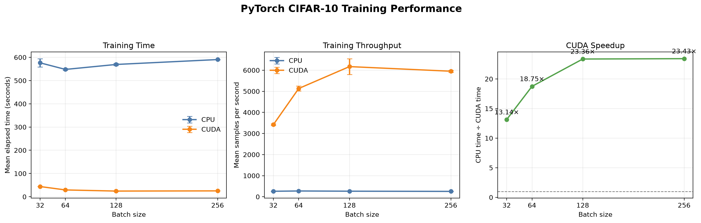

# PyTorch CUDA Benchmark

PyTorch CUDA Benchmark measures CPU and NVIDIA CUDA training performance for an adapted ResNet-18 on CIFAR-10. It executes a controlled matrix of batch sizes and repetitions, records the environment and raw measurements, and generates technical and publication-ready visualizations.

## Published Benchmark

The published benchmark completed 24 measured runs on an Intel Core Ultra 7 265K and NVIDIA GeForce RTX 5070 Ti.

| Device | Measured runs | Processed samples | Total measured time |
|---|---:|---:|---:|
| CPU | 12 | 1,800,000 | 1 hr 54 min 12 sec |
| CUDA | 12 | 1,800,000 | 6 min 08 sec |

- Aggregate CUDA speedup: **18.62×**
- Measured training time saved: **1 hr 48 min 04 sec**
- Highest batch-size speedup: **23.43× at batch size 256**



### Results by Batch Size

Each value is the mean of three repetitions. Training times cover three epochs per run.

| Batch size | CPU time (s) | CUDA time (s) | CPU samples/s | CUDA samples/s | CUDA speedup |
|---:|---:|---:|---:|---:|---:|
| 32 | 576.38 | 43.88 | 260.41 | 3,418.57 | 13.14× |
| 64 | 547.98 | 29.23 | 273.74 | 5,132.96 | 18.75× |
| 128 | 569.36 | 24.37 | 263.47 | 6,171.07 | 23.36× |
| 256 | 590.44 | 25.20 | 254.05 | 5,951.50 | 23.43× |

The complete published run is available in [`results/run-20260908T140828_391861Z`](results/run-20260908T140828_391861Z/):

- [Raw measurements](results/run-20260908T140828_391861Z/benchmark_results.csv)
- [Configuration snapshot](results/run-20260908T140828_391861Z/configuration.json)
- [Environment snapshot](results/run-20260908T140828_391861Z/environment.json)
- [Social summary](results/run-20260908T140828_391861Z/benchmark_social_card.png)
- [Batch-size speedup graph](results/run-20260908T140828_391861Z/benchmark_speedup_graph.png)
- [Benchmark receipt](results/run-20260908T140828_391861Z/benchmark_receipt.png)

## Benchmark Design

| Setting | Value |
|---|---|
| Dataset | CIFAR-10 training split |
| Model | ResNet-18 adapted for 32×32 images |
| Devices | CPU and CUDA |
| Batch sizes | 32, 64, 128, and 256 |
| Epochs | 3 per run |
| Repetitions | 3 per device and batch size |
| Total runs | 24 |
| Seeds | 42, 43, and 44 |
| Warm-up | 10 batches per run |
| CUDA mixed precision | Disabled |
| Data loader workers | 4 |
| Pinned memory | Enabled |

Each repetition uses the same seed on both devices. This preserves equivalent model initialization and data ordering across the CPU and CUDA comparisons.

## Tested Environment

| Component | Published environment |
|---|---|
| Operating system | Windows 11 |
| CPU | Intel Core Ultra 7 265K |
| CPU cores | 20 physical, 20 logical |
| GPU | NVIDIA GeForce RTX 5070 Ti |
| GPU memory | 16 GB |
| System memory | 32 GB |
| Python | 3.12.9 |
| PyTorch | 2.14.0+cu130 |
| Torchvision | 0.29.0+cu130 |
| CUDA build | 13.0 |
| Compute capability | 12.0 |

## Installation

The following procedure reproduces the tested Windows PowerShell environment.

### 1. Clone the Repository

```powershell
git clone https://github.com/aliraaza95/pytorch-cuda-benchmark.git
Set-Location .\pytorch-cuda-benchmark
```

### 2. Create a Virtual Environment

```powershell
py -3.12 -m venv .venv
.\.venv\Scripts\Activate.ps1
python -m pip install --upgrade pip
```

### 3. Install CUDA-Enabled PyTorch

The published benchmark used the CUDA 13.0 PyTorch build:

```powershell
python -m pip install torch==2.14.0 torchvision==0.29.0 --index-url https://download.pytorch.org/whl/cu130
```

A different operating system, driver, or CUDA platform should use the command provided by the official [PyTorch installation selector](https://pytorch.org/get-started/locally/).

### 4. Install the Project

```powershell
python -m pip install --editable .
python -m pip check
```

Project dependencies are defined in `pyproject.toml`; a separate `requirements.txt` file is not required.

### 5. Verify CUDA

```powershell
python -c "import torch; print('PyTorch:', torch.__version__); print('CUDA build:', torch.version.cuda); print('CUDA available:', torch.cuda.is_available()); print('GPU:', torch.cuda.get_device_name(0) if torch.cuda.is_available() else 'Not detected')"
```

`CUDA available` must report `True` before the default benchmark can run.

## Usage

### Inspect the Benchmark Plan

```powershell
python -m pytorch_cuda_benchmark plan
```

This command displays every planned device, batch-size, repetition, and seed combination without starting training.

### Run the Benchmark

```powershell
python -m pytorch_cuda_benchmark run
```

The default workflow reads `configs/benchmark.yaml`, stores CIFAR-10 under `data`, and writes a timestamped run directory under `results`.

Custom locations can be supplied when required:

```powershell
python -m pytorch_cuda_benchmark run --config .\configs\benchmark.yaml --data-directory .\data --output-directory .\results
```

### List Saved Runs

```powershell
python -m pytorch_cuda_benchmark list
```

The command reports whether each saved run contains a complete, validated benchmark matrix.

### Inspect the Latest Complete Run

```powershell
python -m pytorch_cuda_benchmark show
```

### Inspect a Specific Run

```powershell
python -m pytorch_cuda_benchmark show .\results\run-20260908T140828_391861Z
```

The `show` command validates the saved measurements, prints the complete result matrix, and regenerates the benchmark images.

To open the generated social images after inspection:

```powershell
python -m pytorch_cuda_benchmark show .\results\run-20260908T140828_391861Z --open
```

## Generated Artifacts

Every completed run contains the following files:

| File | Purpose |
|---|---|
| `benchmark_results.csv` | Run-level measurements |
| `configuration.json` | Exact benchmark configuration |
| `environment.json` | Hardware and software metadata |
| `benchmark_comparison.png` | Technical time, throughput, and speedup comparison |
| `benchmark_social_card.png` | Aggregate CPU and CUDA summary |
| `benchmark_speedup_graph.png` | Speedup by batch size |
| `benchmark_receipt.png` | Completion and artifact record |

## Measurement Scope

The reported durations represent measured training intervals rather than complete command wall-clock time.

The timed workload includes batch loading, device transfer, forward propagation, loss calculation, backward propagation, and parameter updates. Model construction, data-loader construction, warm-up batches, result analysis, file writing, and image generation are excluded.

CUDA synchronization is performed around timed regions so elapsed time does not omit asynchronous GPU work. Progress output is emitted outside those regions.

## Interpretation and Limitations

The published result represents one workstation and one software environment. It does not establish universal CPU or GPU performance.

Results can change with:

- processor and GPU power limits;
- thermal conditions;
- background workloads;
- operating-system scheduling;
- PyTorch, CUDA, cuDNN, and driver versions;
- memory and storage performance;
- benchmark configuration changes.

The benchmark measures training performance only. It does not evaluate validation accuracy, inference latency, energy consumption, or hardware cost.

## License

This project is distributed under the [MIT License](LICENSE).
